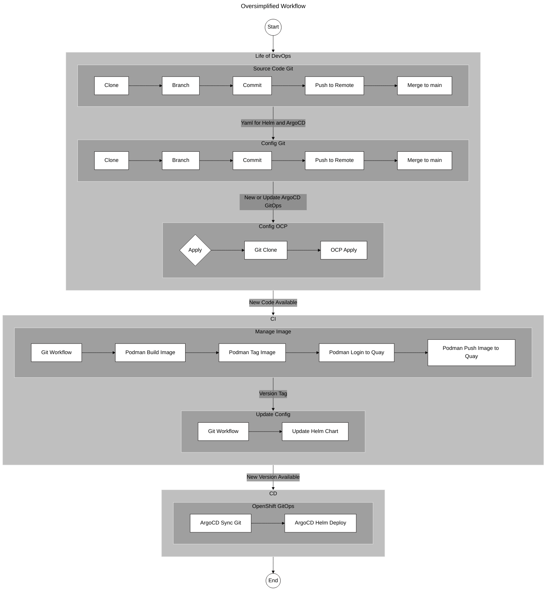

# Very Basic Application to Demonstrate Workflow 

An easy-peasy example of the manual steps from code to deployment.  

1.   build an image and run it (podman)
2.   push the image to an image-registry (quay.io)

Manual steps that will be you CI Integration (eg:  Jenkin's).

## Heads-up

Refer to these TWO git repositories:

1. xyz-app:     Application Code (python, Dockerfile)  Simple, very simple, python application used to demonstrate a basic workflow from source to image. 
2. xyz-gitops:  Helm Charts to manage the deployment, service and routes in Openshift (ultimately for ArgoCD to poll.)

Prepare your host with tools to experiment with:

* Install Podman (CLI)
* And of course, get your git life together
* Setup an image registry , [Quay.io](https://quay.io/repository/Quay.io)
* Install Helm 
* .. and optionally install make

## Why this code?

Simple source files (app.py, requirements.txt, and Dockerfile) form the basic building blocks for the CI steps of your pipeline. 

*Simplicity*: It's a minimal example, easy for non-programmers to understand and programmers can focus on the workflow.
*Container-ready*: The code is designed to run in a container, listening on all network interfaces (host='0.0.0.0') on a standard port.
*CI/CD Integration*: It uses an environment variable (MESSAGE) to view at runtime. Your CI pipeline can inject values, demonstrating a key part of the CI process.

## Crawl through commands ...

* [BuildAndTest](./README_Build.md)
* [PushToRegistry](./README_Registry.md)
* [FYSA - Makefile](./README_Makefile.md)

## Diagram Rough Draft 

